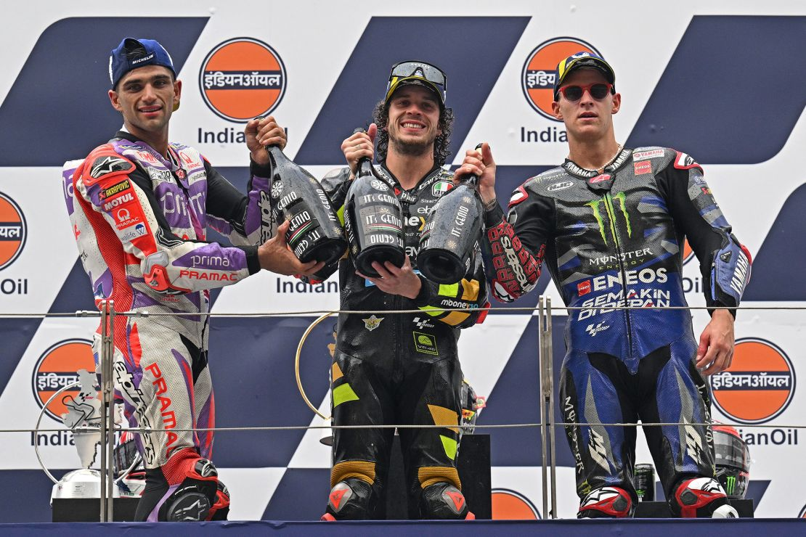

# MotoGP Podium Classification

**Author**

Ryan Beckman

## Executive summary
This research addresses the question of maximizing ROI for a sponsor for an upcoming MotoGP season. While there are a number of ways this question can be addressed, for the purpose of this research it was decided to build a model that predicts who is likely to achieve a podium (first, second, or third place) for a race, thus allowing a sponsor to predict who is likely to achieve the most podiums for a given season.

Two models were created as part of this research, demonstrating 97% effectiveness in correctly predicting podiums for a race.

The most important factors in predicting if a podium would be achieved are the racer followed subsequently by the team they are a part of. Surprisingly, the actual motorcycle involved played a relatively less significant role in achieving a podium.

## Rationale
MotoGP is one of the biggest motorcycle competitions in the world, with [over 400 million fans estimated worlwide in 2021](https://motochronicle.com/how-many-motogp-fans-in-the-world/). Further, MotoGP gained $283 million from sponsorship in 2020. Clearly, a lot of money is at stake. If a model that could predict podiums increased classification precision by even 5%, sponsors utilizing this model could see potentially tens of millions more fans purchasing their products, and given that motorcycle goods aren't particularly cheap, with cheaper accessories ranging in the $100's of dollars and high end performance motorcycles in the mid five digit range and more, this could easily increase revenue for a sponsor by billions of dollars annually.

## Research Question
As a potential sponsor, where should I invest my money to get the most effective ROI?

## Data Sources
[Kaggle Moto GP World Championship](https://www.kaggle.com/datasets/alrizacelk/moto-gp-world-championship19492022/data)

## Methodology
The classification models Random Forest and XGBoost will be used to classify whether a sample would achieve a podium for a given race. A podium is defined as achieving 1st, 2nd, or 3rd place (thus increasing air time while receiving award). 

Classification will focus on two scores, the F0.5 Score and the Precision Score. The reasoning behind this is that sponsors only have limited chances to sponsor for a given race season, thus metrics focusing on effective assessment of True Positives (samples predicted as having obtained a podium actually having obtained a podium) is critical. The purpose of using F0.5 is that the data is inherently imbalanced (only a three racers achieve a podium per race), and thus accounting for the harmonic score between recall and precision, with an emphasis on precision will be a better indicator than precision by itself.

To address the issue of class imbalance to approaches will be used and compared, weighting the classes relative to their proportion (class_weight) and balancing the data using SMOTE.

Hyperparameters will be tuned using Bayesian Search Methods found in Scikit-Optimize.

After hyperparameter tuning, further adjustments will be made to the Decision Threshold to improve F0.5 and Precision Scores.

After model training is completed I plan to use a graphical representation of a sample of the trees created as well as permutation importance to build an inference as to the critical factors for achieving a podium. This evluation is a critical component of this process from a sponsor perspective, as a sponsor would want to know which factors are most likely to lead to podiums when deciding where to invest sponsorship money.

## Environment Setup

### Dependencies:
The easiest way to install Anaconda is from the [online download source](https://www.anaconda.com/download). See the [installation page](https://docs.anaconda.com/free/anaconda/install/index.html) for more details on installation process. After downloading open Anaconda Navigator to download Jupyter Notebook

The dependencies required to run this project are quite particular. In order to simplify the process of setting up an environment to run the project a **environment.yml** file has been created. The suggested approach to environment setup is to create a new environment using the included file (from project root directory):

```bash
  conda env create -f environment.yml
  conda activate motogp
```

### Running Jupyter Notebook
After installing dependencies, run a new Jupyter Notebook instance from root of project:

```bash
  jupyter notebook
```

## Results
| **Model**     | **F0.5 Score (Test)** | **Precision Score (Test)** |
|---------------|-----------------------|----------------------------|
| Random Forest | 92.79%                | 96.85%                     |
| XGBoost       | 92.13%                | 93.74%                     |

Random Forest performed slightly better in regards to F0.5 and Precision Scores. However, the difference was marginal and likely wouldn't make a significant difference when picking the top candidates for sponsor investment.

Both models definitively indicated that the rider played the most crucial role in determining the effectiveness of classification, thus showing that riding skill trumps any other factor when assessing if a racer will perform well in a race.

Subsequent factors diverged between the two models, but team support was a high feature for both models, and the type of bike was surprisingly a lower feature relatively for both models.

## Next steps
Given the relative importance the rider in determining overall performance, there is merit to performing a more indepth analysis of the racers involved with MotoGP. Perhaps building a model around riders that predicts the number of points they would achieve in a given season and evaluating relevant factors. Such a study would benefit from including as much metadata as possible. That is, information such as "Years of MotoGP Experience", "Previous Placements for a Given Circuit", "Amount of Sponsorship Money Per Year", etc.

Another area that merits follow up would be building a model around championship classification. That is, predicting who achieves the most points in a given season. While this would likely not score as well as a model that classifies podiums, there is significant value in attempting to predict the champion for a season as first place for a season has a significantly higher impact on related sales than other riders with high numbers of podiums.

## Outline of project
- [MotoGP Podium Classification](./motogp-podiums.ipynb#)
- [Modeling](./motogp-podiums.ipynb#modeling)
- [Evaluation](./motogp-podiums.ipynb#evaluation)


## Contact and Further Information
Ryan Beckman

Email: beckman.ryan@gmail.com

[LinkedIn](https://www.linkedin.com/in/beckmanryan/)

[GitHub](https://github.com/zaldabus)


## License

[MIT License](https://choosealicense.com/licenses/mit/)